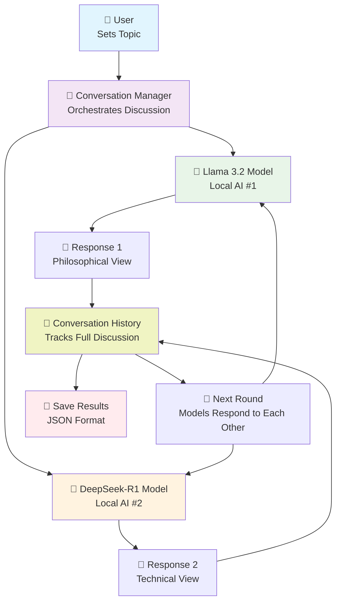

# Local LLM Conversations 🤖💬

> **AI Models Talking to Each Other - Completely Free & Private**

## What Is This? 🎯

**Simple Explanation:** This tool makes two different AI models have conversations with each other, like watching two smart people debate a topic. Everything runs on your computer - no internet needed after setup!

**Perfect For:**
- 🎓 **Students & Researchers**: Study how different AI models think
- 🧠 **AI Enthusiasts**: Explore AI personality differences
- 💼 **Businesses**: Compare AI model capabilities for free
- 👥 **Teams**: Demonstrate AI technology to stakeholders
- 🔬 **Educators**: Teaching tool for AI concepts

---

## 🚀 Why This Is Amazing

### **💰 Cost Benefits**
- **$0 per conversation** (vs $0.02-0.10 per message with cloud APIs)
- **Unlimited conversations** once set up
- **No monthly subscriptions** or usage limits

### **🔒 Privacy & Security**
- **100% Local Processing** - nothing sent to external servers
- **Your conversations stay private** - no data collection
- **Work offline** after initial model download
- **Perfect for sensitive discussions**

### **🎯 Educational Value**
- **Compare AI models** side by side
- **Study conversation patterns** and AI reasoning
- **Understand AI personalities** and biases
- **Learn prompt engineering** techniques

---

## 🎬 How It Works (Visual Guide)

### **The Conversation Flow**
```
👤 You: "Do you think AI will help humanity?"
    ↓
🤖 DeepSeek: "It depends on how we build and use it."
    ↓
🦙 Llama: "I agree, but we need proper safeguards..."
    ↓
🤖 DeepSeek: "Exactly! Regulation and ethics are key..."
    ↓
🦙 Llama: "Though innovation shouldn't be stifled..."
    ↓
... (continues for as many rounds as you want)
```

### **System Architecture**



---

## 🛠️ Quick Setup (5 Minutes)

### **What You Need**
- 💻 **Computer**: Windows, Mac, or Linux (8GB+ RAM recommended)
- 🐍 **Python 3.8+**: [Download here](https://python.org)
- 🔧 **Ollama**: Local AI runtime [Get it here](https://ollama.ai)

### **Step-by-Step Installation**

#### **1. Install Ollama**
```bash
# macOS
brew install ollama

# Linux
curl -fsSL https://ollama.ai/install.sh | sh

# Windows: Download from https://ollama.ai
```

#### **2. Download AI Models**
```bash
# Start Ollama service
ollama serve

# In a new terminal, download models (one-time, ~4GB total)
ollama pull llama3.2
ollama pull deepseek-r1:1.5b
```

#### **3. Get the Code**
```bash
git clone https://github.com/pppop00/local-llm-conversations.git
cd local-llm-conversations
pip install -r requirements.txt
```

#### **4. Run Your First Conversation**
```bash
python llm_conversation.py
```

---

## 🎮 How to Use It

### **Basic Usage (Copy & Paste Ready)**

```python
import ollama

llama_model = "llama3.2"
deepseek_model = "deepseek-r1:1.5b" 

# Set your conversation topic here
llama_messages = ["What's the future of remote work?"]
deepseek_messages = ["I think it's here to stay, but it needs better tools."]

def call_ollama(model, history, system=None):
    messages = [{"role": "system", "content": system}] if system else []
    messages += history
    response = ollama.chat(model=model, messages=messages)
    return response['message']['content']

# Run 5 rounds of conversation
for _ in range(5):
    # llama3 responds
    llama_history = []
    for u, a in zip(llama_messages, deepseek_messages):
        llama_history.append({"role": "user", "content": u})
        llama_history.append({"role": "assistant", "content": a})
    llama_history.append({"role": "user", "content": llama_messages[-1]})
    llama_reply = call_ollama(llama_model, llama_history)
    print(f"\n🦙 llama3:\n{llama_reply}\n")
    llama_messages.append(llama_reply)

    # deepseek responds
    deepseek_history = []
    for u, a in zip(deepseek_messages, llama_messages[1:]):
        deepseek_history.append({"role": "user", "content": u})
        deepseek_history.append({"role": "assistant", "content": a})
    deepseek_history.append({"role": "user", "content": deepseek_messages[-1]})
    deepseek_reply = call_ollama(deepseek_model, deepseek_history)
    print(f"\n🤖 deepseek-coder:\n{deepseek_reply}\n")
    deepseek_messages.append(deepseek_reply)
```

---

## 🧠 How the Code Works (Step-by-Step Explanation)

### **For Beginners & Non-Programmers**

The code is surprisingly simple! Here's what each part does:

#### **1. Setup the Models**
```python
llama_model = "llama3.2"
deepseek_model = "deepseek-r1:1.5b" 
```
*This tells the program which AI models to use. Think of them as two different AI "personalities".*

#### **2. Start the Conversation**
```python
llama_messages = ["Do you think AI will help or hurt humanity in the long run?"]
deepseek_messages = ["That's a great question. I think it depends on how we build and use it."]
```
*These are the opening lines - like starting a debate between two people.*

#### **3. The Magic Function**
```python
def call_ollama(model, history, system=None):
    messages = [{"role": "system", "content": system}] if system else []
    messages += history
    response = ollama.chat(model=model, messages=messages)
    return response['message']['content']
```
*This function talks to the AI models. It's like asking a question and getting an answer.*

#### **4. The Conversation Loop**
```python
for _ in range(5):  # Do this 5 times
```
*This repeats the conversation for 5 rounds. You can change this number!*

#### **5. Building Memory**
```python
llama_history = []
for u, a in zip(llama_messages, deepseek_messages):
    llama_history.append({"role": "user", "content": u})
    llama_history.append({"role": "assistant", "content": a})
```
*This gives each AI model "memory" of what was said before, so they can have a real conversation.*

#### **6. Getting Responses**
```python
llama_reply = call_ollama(llama_model, llama_history)
print(f"\n🦙 llama3:\n{llama_reply}\n")
llama_messages.append(llama_reply)
```
*Ask Llama for a response, print it out, and remember it for next time.*

### **The Clever Part** 🤓

Each AI model sees the conversation from their own perspective:
- **Llama** sees DeepSeek's messages as "user input" 
- **DeepSeek** sees Llama's messages as "user input"
- This makes them respond to each other naturally!

### **Easy Customizations**

**Change the topic:**
```python
llama_messages = ["What's the best pizza topping?"]
deepseek_messages = ["I think pepperoni is classic, but I'm curious about your thoughts."]
```

**Change the number of rounds:**
```python
for _ in range(10):  # Now they'll talk for 10 rounds instead of 5
```

**Use different models:**
```python
llama_model = "mistral:7b"  # Try a different model
deepseek_model = "codellama"  # Or this one for coding discussions
```

---

### **Advanced Examples**

#### **Philosophy Debate**
```python
import ollama

llama_model = "llama3.2"
deepseek_model = "deepseek-r1:1.5b" 

# Philosophy topic
llama_messages = ["Is free will real or just an illusion?"]
deepseek_messages = ["That's one of philosophy's hardest questions..."]

def call_ollama(model, history, system=None):
    messages = [{"role": "system", "content": system}] if system else []
    messages += history
    response = ollama.chat(model=model, messages=messages)
    return response['message']['content']

# Add personality with system prompts
llama_system = "You are a determinist philosopher who believes everything is predetermined."
deepseek_system = "You are a libertarian philosopher who believes in genuine free choice."

for _ in range(5):
    # Rest of the code stays the same, but add system prompts:
    llama_reply = call_ollama(llama_model, llama_history, llama_system)
    deepseek_reply = call_ollama(deepseek_model, deepseek_history, deepseek_system)
```

#### **Business Strategy Discussion**
```python
# Business topic
llama_messages = ["How should startups approach AI integration in 2025?"]
deepseek_messages = ["Start small, focus on specific problems, measure impact."]

# Business personalities
llama_system = "You are a cautious CFO focused on ROI and risk management."
deepseek_system = "You are an innovative CTO excited about AI possibilities."

# Use same conversation loop as above
```

#### **Technical Debate**
```python
# Technical topic
llama_messages = ["Is Python or JavaScript better for beginners?"]
deepseek_messages = ["Both have merits, but I lean toward Python for its readability."]

# Technical personalities  
llama_system = "You are a Python advocate who values simplicity and readability."
deepseek_system = "You are a JavaScript enthusiast who loves versatility and web focus."

# Use same conversation loop for 3 rounds
```

---

## 💡 Creative Use Cases

### **For Educators**
- **Socratic Dialogues**: Recreate famous philosophical debates
- **Historical Perspectives**: Have AI models roleplay historical figures
- **Scientific Discussions**: Explore different theories and viewpoints

### **For Businesses**
- **Strategy Sessions**: Simulate different stakeholder perspectives
- **Risk Analysis**: Explore optimistic vs pessimistic scenarios  
- **Product Development**: Debate features from user vs developer perspectives

### **For Personal Learning**
- **Decision Making**: Explore pros and cons of important choices
- **Creative Writing**: Generate dialogue between characters
- **Language Learning**: Practice conversations in different languages

---

## 📊 Model Comparison

| Feature | 🦙 Llama 3.2 | 🤖 DeepSeek-R1 |
|---------|---------------|-----------------|
| **Personality** | Balanced, thoughtful | Technical, precise |
| **Strengths** | General knowledge, reasoning | Coding, math, logic |
| **Response Style** | Conversational | Structured |
| **Best For** | Philosophy, creativity | Technical discussions |
| **Size** | ~2GB | ~1.5GB |
| **Speed** | Medium | Fast |

---

## 🎯 Real Conversation Examples

### **Example 1: AI Ethics Discussion**

**Topic**: "Should AI systems be allowed to make medical diagnoses?"

**🦙 Llama**: "This is a complex issue that requires balancing AI capabilities with human oversight. While AI can process vast amounts of medical data quickly, the stakes in healthcare are too high for fully autonomous diagnosis."

**🤖 DeepSeek**: "I agree on the need for human oversight, but we should consider the potential benefits. AI diagnostic tools could help in underserved areas where specialist doctors are scarce, as long as they're properly validated and used as decision support tools."

**🦙 Llama**: "That's a good point about accessibility. Perhaps the key is in how we implement these systems - not as replacements for doctors, but as sophisticated tools that can flag potential issues and suggest further investigation."

### **Example 2: Technology Debate**

**Topic**: "Will quantum computing make current encryption obsolete?"

**🤖 DeepSeek**: "Quantum computing poses a real threat to current RSA and elliptic curve cryptography, but the timeline is still uncertain. Most estimates suggest we have 10-20 years before quantum computers can break current encryption at scale."

**🦙 Llama**: "True, but shouldn't we be preparing now? The transition to quantum-resistant cryptography will take years to implement across all systems. Waiting until quantum computers are a immediate threat might be too late."

---

## 🔧 Customization Options

### **Change Models**
```python
# Use different models
chat = LocalLLMConversation(
    model1="llama3.2:13b",  # Larger, more capable model
    model2="mistral:7b"     # Different model entirely
)
```

### **Adjust Conversation Length**
```python
# Short conversation
chat.start_conversation(topic, response, rounds=2)

# Extended debate
chat.start_conversation(topic, response, rounds=10)
```

### **Custom Personalities**
```python
chat.start_conversation(
    topic="Best programming language for AI?",
    response="It depends on your specific needs...",
    rounds=4,
    system_prompt1="You are an enthusiastic Python developer who thinks Python is perfect for everything.",
    system_prompt2="You are a performance-focused C++ developer who prioritizes speed and efficiency."
)
```

---

## 💰 Cost Analysis

### **Traditional Cloud AI Conversation**
```
OpenAI GPT-4: ~$0.06 per 1000 tokens
Claude: ~$0.015 per 1000 tokens
Typical 5-round conversation: ~$0.50-1.00
Monthly cost (100 conversations): $50-100
```

### **This Local System**
```
Setup cost: $0 (free software)
Per conversation: $0
Monthly cost: $0
Annual savings: $600-1200+
```

### **Hardware Requirements**
- **Minimum**: 8GB RAM, 10GB storage
- **Recommended**: 16GB RAM, SSD storage
- **One-time cost**: Use existing computer
- **Electricity**: ~$0.01 per hour of usage

---

## 🛡️ Privacy & Security

### **What Stays Private**
- ✅ **All conversations** remain on your computer
- ✅ **No data collection** or telemetry
- ✅ **No internet required** after model download
- ✅ **Complete control** over all data

### **Enterprise Benefits**
- **Air-gapped deployment** possible
- **No compliance concerns** about data sharing
- **Unlimited internal usage** without legal restrictions
- **Custom model training** on proprietary data

---

## 🔍 Troubleshooting

### **Common Issues**

**❌ "Model not found" error**
```bash
# Solution: Download the required models
ollama pull llama3.2
ollama pull deepseek-r1:1.5b
```

**❌ "Connection refused" error**
```bash
# Solution: Start Ollama service
ollama serve
```

**❌ "Out of memory" error**
```bash
# Solution: Use smaller models
ollama pull llama3.2:1b
ollama pull deepseek-r1:1.5b
```

**❌ Slow responses**
```bash
# Solutions:
# 1. Close other applications
# 2. Use smaller models
# 3. Reduce conversation rounds
```

### **Performance Tips**
- **Close other apps** to free up RAM
- **Use SSD storage** for faster model loading
- **Start with smaller models** for testing
- **Adjust conversation length** based on your patience

---

## 🤝 Contributing & Community

### **Ways to Contribute**
- 🐛 **Report bugs** or issues
- 💡 **Suggest new features** or conversation topics
- 📚 **Improve documentation** 
- 🔧 **Add new model support**
- 🎨 **Create example conversations**

### **Community Ideas**
- **Conversation templates** for different subjects
- **Educational curricula** using AI debates
- **Business case studies** with AI discussions
- **Creative writing prompts** and character dialogues

---

## 📚 Educational Resources

### **For Beginners**
- **What is a Large Language Model?** Understanding AI basics
- **How do AI models "think"?** Exploring neural networks simply
- **Why do models give different answers?** Understanding training differences

### **For Advanced Users**
- **Prompt engineering techniques** for better conversations
- **Model fine-tuning** for specific domains
- **Conversation analysis** and pattern recognition
- **Custom model integration** with Ollama

---

## 🎉 Success Stories

> *"Used this for my computer science class to demonstrate AI model differences. Students loved seeing the 'personalities' emerge!"*
> — CS Professor

> *"Great for brainstorming sessions. Having two AI perspectives helps us think through problems more thoroughly."*
> — Product Manager

> *"Perfect for understanding AI capabilities before investing in expensive cloud solutions."*
> — Startup CTO

---

## 📄 Technical Specifications

### **Supported Models**
- **Llama family**: llama3.2, llama3.2:13b, llama3.2:70b
- **DeepSeek family**: deepseek-r1:1.5b, deepseek-r1:7b
- **Mistral family**: mistral:7b, mistral:13b
- **Code models**: codellama, deepseek-coder
- **Custom models**: Any Ollama-compatible model

### **Output Formats**
- **Console**: Real-time conversation display
- **JSON**: Structured data for analysis
- **Text**: Simple conversation logs
- **Custom**: Extensible output system

---

## 🚀 What's Next?

### **Planned Features**
- 📊 **Conversation analytics** and insights
- 🎨 **Web interface** for easier use
- 📱 **Mobile app** for on-the-go conversations
- 🔌 **API integration** for other applications
- 🎯 **Specialized conversation templates**

### **Get Involved**
- ⭐ **Star this repository** to show support
- 🔔 **Watch for updates** and new features
- 💬 **Join discussions** in GitHub Issues
- 🤝 **Contribute code** or documentation

---

**Ready to watch AI models debate?** 🎭

*Start your first conversation in under 5 minutes. No accounts, no API keys, no monthly fees - just pure AI interaction running on your computer!*
